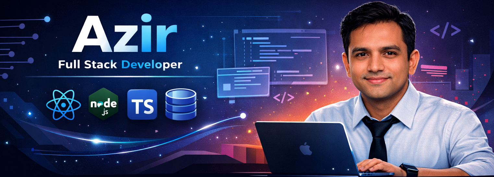

Full-Stack Developer • 6+ Years Experience • Clean & Practical Solutions

---

# 💫 About Me

I am a Senior Software Engineer with 9+ years of experience designing, developing, and scaling backend systems, with expertise in Node.js, Python, C#, cloud platforms, and database optimization. I specialize in improving system performance, reducing latency, and leading teams to deliver high-impact, reliable solutions.

---
## 🧰 Core Stack

### **Frontend**
- **React** • **Next.js** • **TypeScript** • **JavaScript** • **Redux** • **Tailwind CSS**  
- **HTML/CSS** • **SASS** • **NextUI** • **DaisyUI**

### **Backend**
- **Node.js** • **Express.js** • **ASP.NET Core** • **.NET Framework**  
- **REST APIs** • **GraphQL** • **Microservices Architecture** • **Distributed Systems**  
- **Modular Monolith Architecture** • **Event-Driven Architecture** • **Asynchronous Processing**  
- **Background Job Processing** • **Queue-Based Processing** • **API Latency Optimization**  
- **Backend Performance Tuning** • **Rate Limiting** • **Redis Distributed Caching**

### **Database**
- **PostgreSQL** • **SQL Server** • **MongoDB** • **Redis**  
- **Query Optimization** • **Execution Plan Analysis** • **Database Indexing Strategies**  
- **Transaction Management**

### **Cloud & DevOps**
- **AWS** (EC2, S3, Lambda) • **Docker** • **CI/CD Pipelines** • **Deployment Automation**

### **Testing & Quality**
- **Unit Testing** • **Integration Testing** • **Production Debugging** • **Code Reviews**

### **System Monitoring & Observability**
- **Incident Response** • **Root Cause Analysis** • **System Monitoring** • **Backend Refactoring**

### **Leadership & Mentorship**
- **Technical Mentorship** • **Team Leadership** • **Code Reviews**  

---

## 🌐 Socials:

   

# 💼 My latest projects

Here is a collection of my full-stack and frontend web development projects. Each project includes GitHub repositories and live demo links.

| Project Name                 | Description                                                                                                                                     | GitHub Link                                                                                  | Live Demo Link                                             |
|-----------------------------|-------------------------------------------------------------------------------------------------------------------------------------------------|-----------------------------------------------------------------------------------------------|------------------------------------------------------------|
| *Digital Wallet*     | Full-stack digital wallet platform with JWT authentication, role-based access (user/admin/agent), and secure transaction flows. Built with React, TypeScript, Node.js, Express, MongoDB, and Tailwind. | [GitHub](https://github.com/azir9200/digital-wallet-transactly)                                 | [Live Demo](https://digital-wallet-transactly.vercel.app)                 |
| *Latest Food Display*     | A full-stack web app to discover, post, rate, and review street food spots. Includes premium features via *SSLCommerz/ShurjoPay*, user authentication (JWT), role-based access, and admin content moderation. Built with *Next.js*, *Tailwind CSS*, *Node.js*, *Express*, *Prisma*, *PostgreSQL*. | [GitHub](https://github.com/azir9200/latest_food_display)                                 | [Live Demo](https://latest-food-display.vercel.app)                 |
| *e-commerce-project*             | A frontend website for browsing and buying products online.       | [GitHub](https://github.com/azir9200/imagine-redux-story)                                           | [Live Demo](https://imagine-redux-story.vercel.app) |
| *PH Health Care*   |   It is hospital Management project where have doctor , patients, admin  or user can play a diffrent role about health and hospital related.                  | [GitHub](https://github.com/azir9200/ph_healthcare_frontend-)          | [Live Demo](https://ph-healthcare-frontend-two.vercel.app)         |
| *Book Store Project*           | A Book Display project that showing a list of book. A platform where users can book appointments and reservations with available service providers.               | [GitHub](https://github.com/azir9200/explore-nextjs-nextui)                                 | [Live Demo](https://car-refresh-service.vercel.app/)                   |

---

## 🌐 Connect

---

## 📊 GitHub Stats

---

## 📫 Contact

**Linkedin:** https://linkedin.com/in/azir9200  
**Profile:** https://github.com/azir9200

---

⭐️ Thanks for visiting — always open to collaboration.
